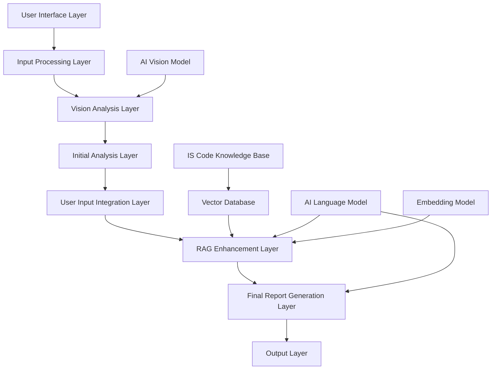
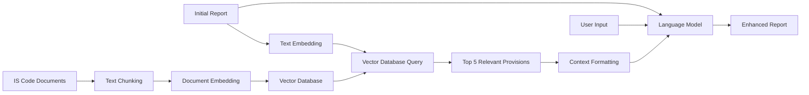
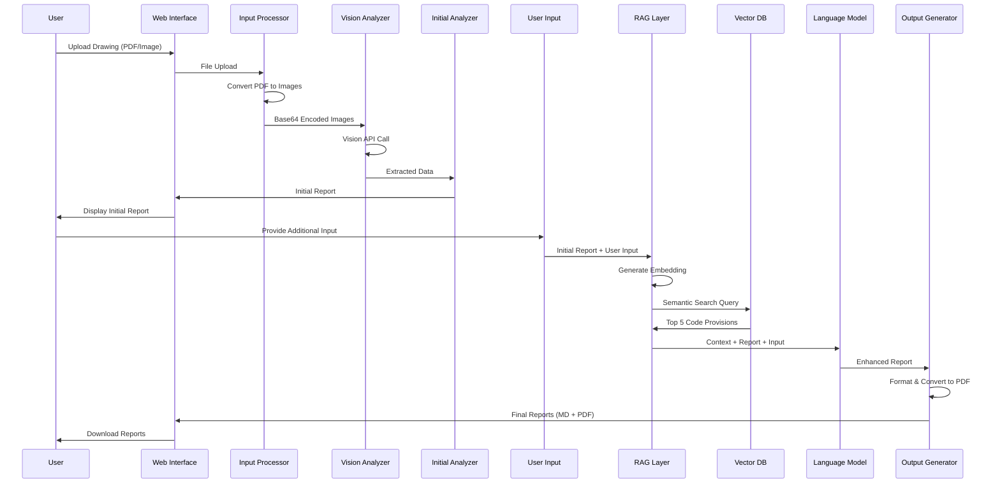
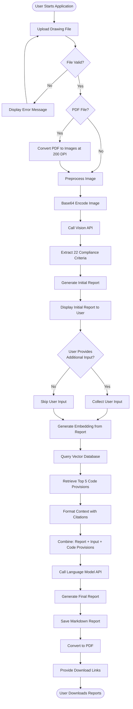
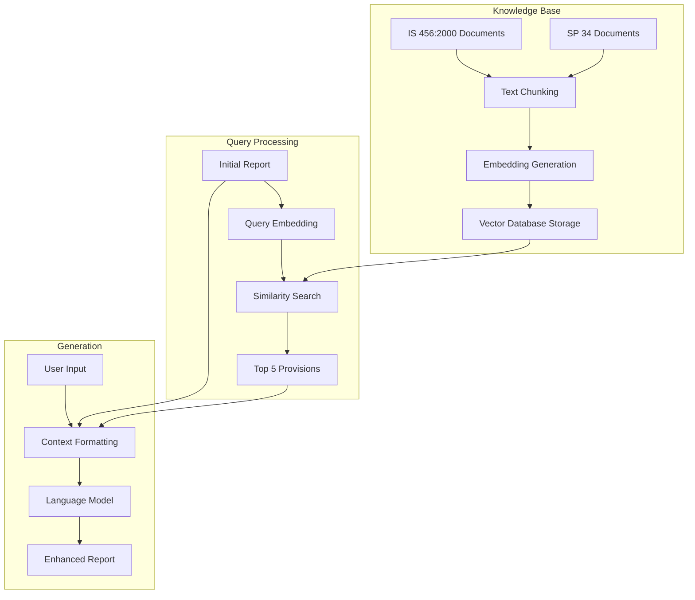
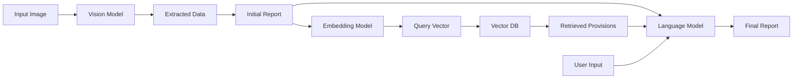

# Methodology

## Project Overview

This project implements an AI-powered automated compliance checking system for structural design drawings, specifically designed to verify RCC (Reinforced Cement Concrete) foundation drawings against Indian Standards IS 456:2000 and SP 34. The system combines computer vision, natural language processing, and retrieval-augmented generation (RAG) to automate the traditionally manual process of structural drawing compliance verification.

The system addresses critical challenges in structural engineering compliance verification, including time-consuming manual review processes, potential human error, inconsistent interpretation of code provisions, and difficulty in maintaining up-to-date knowledge of evolving standards. By leveraging state-of-the-art AI technologies, the system provides rapid, accurate, and traceable compliance verification with specific code clause citations.

## System Architecture

### High-Level Architecture

The system follows a multi-stage pipeline architecture consisting of six key layers, each responsible for specific processing tasks. The architecture is designed for modularity, scalability, and maintainability, allowing individual components to be updated or replaced without affecting the entire system.



### Detailed Component Architecture

#### 1. Input Processing Layer

The input processing layer serves as the entry point for all user interactions and file uploads. It handles multiple file formats, validates inputs, and prepares data for downstream processing.

**Components:**
- **File Upload Handler**: Manages PDF and image file uploads through Streamlit's file uploader widget
- **Format Validator**: Verifies file types (PDF, PNG, JPG, JPEG, GIF, BMP, WEBP) and validates file integrity
- **PDF Converter**: Converts PDF documents to high-resolution images using PyMuPDF at 200 DPI resolution
- **Image Preprocessor**: Ensures RGB format compatibility, handles color space conversion, and prepares images for API transmission
- **Batch Processor**: Manages multi-page documents and processes images sequentially or in parallel batches

**Technical Specifications:**
- PDF to image conversion: 200 DPI resolution for optimal text and detail clarity
- Supported image formats: PNG, JPG, JPEG, GIF, BMP, WEBP
- Maximum file size: Configurable (default 50MB per file)
- Image preprocessing: Automatic RGB conversion, aspect ratio preservation
- Error handling: Graceful degradation for corrupted or unsupported files

#### 2. Vision Analysis Layer

The vision analysis layer employs advanced computer vision AI models to extract structured information from engineering drawings. This layer interprets technical drawings, recognizes symbols, dimensions, annotations, and textual information.

**Components:**
- **Base64 Encoder**: Converts images to base64-encoded strings for API transmission
- **Vision API Client**: Interfaces with OpenRouter API for Google Gemini 2.5 Flash vision model
- **Prompt Engineering Module**: Constructs structured prompts for consistent information extraction
- **Response Parser**: Extracts structured data from AI model responses
- **Data Validator**: Validates extracted information against expected formats

**Technical Specifications:**
- Vision Model: Google Gemini 2.5 Flash via OpenRouter API
- Image Encoding: Base64 format with MIME type specification
- Prompt Structure: System instructions + structured extraction template
- Response Format: JSON-structured markdown with predefined schema
- Extraction Criteria: 22 compliance parameters (detailed below)

**Extracted Compliance Criteria:**
1. Concrete Grade (M20, M25, M30, etc.)
2. Reinforcement Grade (Fe415, Fe500, etc.)
3. Lap Length Specifications
4. Clear Cover Requirements
5. Development Length
6. Safe Bearing Capacity
7. Seismic Zone Information
8. Building Limitations
9. Structure Purpose/Type
10. Floor Heights
11. Footing Schedule
12. Reinforcement Detailing
13. Column Specifications
14. Beam Specifications
15. Slab Specifications
16. Foundation Type
17. Load Specifications
18. Material Specifications
19. Dimensioning Standards
20. Annotation Completeness
21. Drawing Scale Verification
22. Code Standard References

#### 3. Initial Analysis Layer

The initial analysis layer performs first-pass compliance checking against predefined criteria. It structures the extracted information into a comprehensive initial report format.

**Components:**
- **Compliance Checker**: Compares extracted values against code requirements
- **Report Structurer**: Organizes information into structured markdown format
- **Status Classifier**: Categorizes each criterion with status indicators
- **Statistics Calculator**: Computes compliance percentages and summary statistics

**Output Structure:**
- Document Type Verification
- Site Location Identification
- Code Standards Confirmation
- NOTES Section Location Verification
- Compliance Checklist Table (22 criteria)
- Missing Information Listing
- Compliance Statistics Summary

**Status Categories:**
- **Compliant**: Extracted value meets code requirements
- **Non-Compliant**: Extracted value violates code requirements
- **Missing Information**: Required information not found in drawing
- **Cannot Verify**: Insufficient information to determine compliance
- **Not Applicable**: Criterion does not apply to this drawing type

#### 4. User Input Integration Layer

The user input integration layer allows users to supplement the AI-extracted information with additional context that may not be visible in drawings.

**Components:**
- **Input Interface**: Text input fields for supplementary information
- **Data Validator**: Validates user-provided data formats
- **Context Merger**: Integrates user input with extracted data
- **Conflict Resolver**: Handles discrepancies between extracted and user-provided data

**User-Providable Information:**
- Site Location (for seismic zone determination)
- Exposure Conditions (mild, moderate, severe, very severe, extreme)
- Limiting Values (custom requirements)
- Additional Specifications
- Project Context
- Design Assumptions

#### 5. RAG Enhancement Layer

The RAG (Retrieval-Augmented Generation) enhancement layer retrieves relevant IS code provisions from a vector database and provides them as context to the language model for accurate code citations.



**Components:**
- **Embedding Generator**: Converts text to 384-dimensional vectors using sentence transformers
- **Vector Database Interface**: Queries ChromaDB for semantic similarity search
- **Retrieval Engine**: Implements cosine similarity search with top-k retrieval
- **Context Formatter**: Formats retrieved provisions with source citations
- **Knowledge Base Manager**: Manages IS code document storage and updates

**Technical Specifications:**
- Embedding Model: all-MiniLM-L6-v2 (sentence-transformers)
- Vector Dimensions: 384 (normalized)
- Similarity Metric: Cosine similarity
- Retrieval Count: Top 5 most relevant provisions
- Database: ChromaDB with persistent storage
- Chunking Strategy: 500-character chunks with 50-character overlap

**Knowledge Base Contents:**
- IS 456:2000 (Plain and Reinforced Concrete - Code of Practice)
- SP 34 (Handbook on Concrete Reinforcement and Detailing)
- Relevant clauses organized by topic
- Cross-references between provisions

#### 6. Final Report Generation Layer

The final report generation layer combines all information sources to produce comprehensive, professionally formatted compliance reports with accurate code citations.

**Components:**
- **Context Integrator**: Merges initial report, user input, and retrieved code provisions
- **Language Model Interface**: Interfaces with Google Gemini 2.5 Flash via OpenRouter
- **Report Generator**: Generates structured markdown reports
- **Citation Validator**: Verifies accuracy of code clause citations
- **Recommendation Engine**: Generates actionable recommendations for non-compliant items

**Technical Specifications:**
- Language Model: Google Gemini 2.5 Flash
- Temperature Setting: 0.1 (low temperature for factual accuracy)
- System Prompt: "Act as an Indian Senior Civil Engineer with expertise in RCC structural design"
- Output Format: Structured markdown with sections, tables, and code blocks
- Report Sections: Integrated analysis, code cross-references, compliance status, recommendations, missing information

#### 7. Output Layer

The output layer handles report formatting, file generation, and user download functionality.

**Components:**
- **Markdown Generator**: Creates timestamped markdown files
- **PDF Converter**: Converts markdown to PDF with professional formatting
- **Format Stylist**: Applies typography, table formatting, headers, and sections
- **File Manager**: Manages report storage and download links
- **Version Tracker**: Maintains timestamped versions for audit trails

**Technical Specifications:**
- Markdown Format: GitHub-flavored markdown with tables and code blocks
- PDF Conversion: WeasyPrint (primary) with ReportLab fallback
- File Naming: `compliance_report_YYYYMMDD_HHMMSS.md/pdf`
- PDF Features: Professional typography, table formatting, page breaks, headers/footers
- Download Formats: Both markdown and PDF available

### Data Flow Architecture



## Technologies and Tools

### Core Technologies

**Programming Language:**
- Python 3.8+ (primary language)
- Standard libraries: os, json, base64, datetime, io
- Third-party packages: streamlit, pymupdf, pillow, sentence-transformers, chromadb, langchain

**Web Framework:**
- Streamlit 1.28.0+: Modern web application framework
  - File upload widgets
  - Session state management
  - Markdown rendering
  - Download functionality
  - Interactive UI components

**AI and Machine Learning:**
- OpenRouter API: Unified interface for multiple AI models
- Google Gemini 2.5 Flash: Multi-modal AI model
  - Vision capabilities: Image understanding, text extraction, symbol recognition
  - Language capabilities: Text generation, context understanding, structured output
- Sentence Transformers: all-MiniLM-L6-v2 model
  - 384-dimensional embeddings
  - Normalized vectors for cosine similarity
  - Fast inference on CPU/GPU
  - Technical terminology handling

**Computer Vision:**
- PyMuPDF (fitz): PDF processing and conversion
  - PDF to image conversion at 200 DPI
  - Multi-page document handling
  - High-quality rendering
- Pillow (PIL): Image manipulation
  - Format conversion (RGB, RGBA, etc.)
  - Image preprocessing
  - Format validation

**Vector Database:**
- ChromaDB: Persistent vector database
  - Efficient similarity search
  - Persistent storage
  - Collection management
  - Metadata filtering support

**Document Processing:**
- LangChain: Document processing framework
  - Text splitting and chunking
  - Document loaders
  - Text processing utilities

**Report Generation:**
- Markdown: Native markdown generation
- WeasyPrint: Primary PDF conversion engine
  - HTML/CSS to PDF conversion
  - Professional typography
  - Table formatting
- ReportLab: Fallback PDF conversion
  - Direct PDF generation
  - Cross-platform compatibility

### API Integration

**OpenRouter API:**
- Endpoint: https://openrouter.ai/api/v1/chat/completions
- Authentication: API key via environment variables
- Model: google/gemini-2.0-flash-exp:free
- Request Format: JSON with base64-encoded images
- Response Format: JSON with markdown/text content
- Rate Limiting: Handled through API key management
- Error Handling: Retry logic with exponential backoff

### Development Tools

**Version Control:**
- Git: Source code version control
- GitHub: Repository hosting

**Environment Management:**
- Environment Variables: Secure API key storage
- .env files: Local configuration management

**Testing:**
- Manual testing with sample drawings
- Validation of extraction accuracy
- Report format verification

## Workflow and Process Flow

### Complete System Workflow



### Stage 1: Input Processing

**Process Steps:**
1. **File Upload Reception**: User uploads file through Streamlit file uploader
2. **File Type Detection**: System identifies file format (PDF or image)
3. **File Validation**: 
   - Size validation (configurable maximum)
   - Format validation (supported types only)
   - Integrity check (file corruption detection)
4. **PDF Conversion** (if applicable):
   - Load PDF document using PyMuPDF
   - Extract all pages
   - Convert each page to image at 200 DPI
   - Store images in memory or temporary storage
5. **Image Preprocessing**:
   - Convert to RGB format (if necessary)
   - Validate image dimensions
   - Ensure proper color space
   - Prepare for base64 encoding
6. **Batch Preparation**: Organize images for sequential or parallel processing

**Error Handling:**
- Invalid file format: Display error message with supported formats
- Corrupted file: Attempt recovery or display error
- Oversized file: Display size limit message
- Conversion failure: Fallback mechanisms and error reporting

### Stage 2: Initial Analysis

**Process Steps:**
1. **Image Encoding**: Convert preprocessed images to base64-encoded strings
2. **Prompt Construction**: Build structured prompt with:
   - System instructions for extraction
   - List of 22 compliance criteria to extract
   - Output format specification (structured markdown)
   - Example format for guidance
3. **API Request**: Send encoded image and prompt to vision API
4. **Response Processing**: 
   - Parse API response
   - Extract structured data
   - Validate extracted values
5. **Compliance Checking**: Compare extracted values against code requirements
6. **Report Generation**: Structure initial report with:
   - Document metadata
   - Compliance checklist table
   - Status indicators
   - Missing information list
   - Statistics summary

**Extraction Prompt Structure:**
```
System: You are an expert structural engineer analyzing RCC foundation drawings.
Task: Extract the following 22 compliance criteria from the drawing:
1. Concrete Grade
2. Reinforcement Grade
... (all 22 criteria)

Output Format: Structured markdown with tables and status indicators.
```

**Compliance Checking Logic:**
- Value extraction: Identify numeric values, text labels, symbols
- Code reference: Compare against IS 456:2000 and SP 34 requirements
- Status assignment: Classify as Compliant/Non-Compliant/Missing/Cannot Verify/Not Applicable
- Confidence scoring: Optional confidence levels for extracted values

### Stage 3: User Input Integration

**Process Steps:**
1. **Report Display**: Present initial report to user in web interface
2. **Input Interface**: Provide text input fields for supplementary information
3. **Data Collection**: Capture user-provided information
4. **Data Validation**: Validate format and consistency of user input
5. **Context Merging**: Integrate user input with extracted data
6. **Conflict Resolution**: Handle discrepancies (user input takes precedence)
7. **Preparation for RAG**: Format combined data for RAG processing

**User Input Categories:**
- **Site Information**: Location, seismic zone, soil conditions
- **Exposure Conditions**: Environmental exposure classification
- **Design Parameters**: Custom requirements, limiting values
- **Additional Context**: Project-specific information
- **Corrections**: Corrections to AI-extracted values

**Integration Strategy:**
- User input supplements missing information
- User input overrides extracted values when provided
- Validation ensures consistency with code requirements
- All user input is preserved for traceability

### Stage 4: RAG-Enhanced Final Report Generation

**Process Steps:**

1. **Embedding Generation**:
   - Combine initial report and user input into query text
   - Tokenize and preprocess text
   - Generate 384-dimensional embedding vector
   - Normalize vector for cosine similarity

2. **Vector Database Query**:
   - Perform cosine similarity search in ChromaDB
   - Retrieve top 5 most relevant code provisions
   - Include metadata (clause numbers, section titles)
   - Calculate similarity scores

3. **Context Formatting**:
   - Format retrieved provisions with source citations
   - Include clause numbers and section references
   - Organize by relevance score
   - Prepare as context for language model

4. **Language Model Prompt Construction**:
   - System prompt: Role as Senior Civil Engineer
   - Context: Retrieved IS code provisions
   - Input: Initial report + user input
   - Instructions: Generate comprehensive compliance report
   - Output format: Structured markdown with citations

5. **Report Generation**:
   - Call language model API with constructed prompt
   - Receive generated report
   - Validate structure and citations
   - Ensure all sections are present

6. **Report Enhancement**:
   - Add specific clause citations
   - Include actionable recommendations
   - Update compliance status based on code provisions
   - List remaining missing information

**RAG Prompt Structure:**
```
System: You are an Indian Senior Civil Engineer with expertise in RCC structural design.
You must verify compliance against IS 456:2000 and SP 34.

Retrieved IS Code Provisions:
[Top 5 relevant provisions with citations]

Initial Analysis Report:
[Initial report content]

User-Provided Information:
[User input content]

Task: Generate a comprehensive compliance report with:
- Integrated analysis
- Specific IS code clause citations
- Updated compliance status
- Actionable recommendations
- Missing information list
```

### Stage 5: Output Generation

**Process Steps:**
1. **Markdown Generation**:
   - Structure final report in markdown format
   - Include all sections with proper headers
   - Format tables and code blocks
   - Add metadata (timestamp, version)

2. **File Saving**:
   - Generate timestamped filename
   - Save markdown file locally
   - Store in session or temporary directory

3. **PDF Conversion**:
   - Convert markdown to HTML (if using WeasyPrint)
   - Apply CSS styling for professional appearance
   - Generate PDF with proper formatting
   - Handle page breaks and headers/footers

4. **Download Preparation**:
   - Create download links for both formats
   - Display in web interface
   - Enable user download

**File Naming Convention:**
- Format: `compliance_report_YYYYMMDD_HHMMSS`
- Example: `compliance_report_20241215_143022.md`
- Both `.md` and `.pdf` extensions

**PDF Styling:**
- Professional typography (serif fonts for body, sans-serif for headers)
- Table formatting with borders and spacing
- Code block formatting with monospace font
- Page breaks between major sections
- Headers and footers with page numbers

## Retrieval-Augmented Generation (RAG) Implementation

### RAG Architecture Overview

The RAG system is the core innovation that enables accurate code citation and compliance verification. It combines information retrieval with generative AI to produce reports with verified code references.



### Knowledge Base Construction

**Document Sources:**
- IS 456:2000: Plain and Reinforced Concrete - Code of Practice
- SP 34: Handbook on Concrete Reinforcement and Detailing
- Additional relevant Indian Standards (as needed)

**Processing Pipeline:**
1. **Document Loading**: Load markdown/text documents
2. **Text Chunking**: 
   - Chunk size: 500 characters
   - Overlap: 50 characters
   - Preserve section boundaries where possible
3. **Metadata Extraction**:
   - Clause numbers
   - Section titles
   - Code standard identifiers
   - Topic categories
4. **Embedding Generation**:
   - Model: all-MiniLM-L6-v2
   - Dimension: 384
   - Normalization: L2 normalization
5. **Database Storage**:
   - Store embeddings in ChromaDB
   - Include metadata for filtering
   - Index for fast retrieval

**Chunking Strategy:**
- Preserve clause boundaries
- Maintain context within chunks
- Overlap ensures no information loss at boundaries
- Metadata links chunks to original clauses

### Retrieval Process

**Query Processing:**
1. **Query Construction**: Combine initial report and user input
2. **Embedding Generation**: Convert query to 384-dimensional vector
3. **Similarity Search**: 
   - Cosine similarity calculation
   - Top-k retrieval (k=5)
   - Score threshold filtering (optional)
4. **Result Formatting**: Format retrieved provisions with citations

**Similarity Calculation:**
- Metric: Cosine similarity
- Formula: `cos(θ) = (A · B) / (||A|| × ||B||)`
- Normalized vectors ensure efficient computation
- Scores range from -1 to 1 (typically 0.3-0.9 for relevant results)

**Retrieval Optimization:**
- Pre-computed embeddings for fast search
- Indexed database for sub-second retrieval
- Metadata filtering for targeted searches
- Relevance ranking by similarity score

### Generation Process

**Context Assembly:**
1. **Retrieved Provisions**: Top 5 most relevant code provisions
2. **Initial Report**: AI-extracted compliance information
3. **User Input**: Supplementary information from user
4. **System Instructions**: Role and task definition

**Language Model Configuration:**
- Model: Google Gemini 2.5 Flash
- Temperature: 0.1 (low for factual accuracy)
- Max Tokens: 4000 (sufficient for comprehensive reports)
- System Role: Indian Senior Civil Engineer
- Output Format: Structured markdown

**Generation Instructions:**
- Integrate all information sources
- Cite specific clause numbers from retrieved provisions
- Provide actionable recommendations
- Maintain professional engineering tone
- Ensure accuracy and traceability

### RAG Benefits

**Accuracy Improvements:**
- Verified code citations (not hallucinated)
- Context-aware compliance checking
- Specific clause references
- Traceable recommendations

**Relevance:**
- Semantic search finds relevant provisions
- Not limited to keyword matching
- Understands technical context
- Retrieves related clauses

**Completeness:**
- Comprehensive code coverage
- Multiple relevant provisions retrieved
- Cross-referenced information
- Complete compliance analysis

**Traceability:**
- Source citations for all recommendations
- Clause numbers for verification
- Retrieval scores for confidence
- Audit trail for compliance

**Updatability:**
- Knowledge base can be updated without model retraining
- New code provisions can be added
- Existing provisions can be revised
- Version control for code standards

## AI and Machine Learning Components

### Vision Model: Google Gemini 2.5 Flash

**Capabilities:**
- Multi-modal understanding (text + images)
- Engineering drawing interpretation
- Technical symbol recognition
- Dimension extraction
- Annotation parsing
- Structured output generation

**Technical Specifications:**
- Model: google/gemini-2.0-flash-exp:free via OpenRouter
- Input: Base64-encoded images with text prompts
- Output: Structured markdown/JSON
- Context Window: Large (supports detailed prompts)
- Processing: Cloud-based API

**Extraction Capabilities:**
- Text Recognition: OCR for handwritten and printed text
- Symbol Recognition: Engineering symbols, notations
- Dimension Extraction: Numerical values with units
- Layout Understanding: Drawing structure and organization
- Relationship Mapping: Connections between elements

**Prompt Engineering:**
- Structured extraction templates
- Example-based learning
- Output format specification
- Error handling instructions
- Validation criteria

### Language Model: Google Gemini 2.5 Flash

**Capabilities:**
- Deep context understanding
- Multi-source information integration
- Professional report generation
- Accurate code citation
- Technical writing

**Technical Specifications:**
- Model: google/gemini-2.0-flash-exp:free via OpenRouter
- Temperature: 0.1 (factual accuracy)
- Max Tokens: 4000
- System Role: Indian Senior Civil Engineer
- Output Format: Structured markdown

**Generation Features:**
- Context Integration: Combines multiple information sources
- Code Citation: Accurate clause number references
- Professional Tone: Engineering report style
- Structured Output: Consistent format
- Actionable Recommendations: Specific improvement suggestions

**Prompt Structure:**
- System message: Role definition and instructions
- Context: Retrieved code provisions
- Input: Initial report and user input
- Instructions: Output requirements
- Examples: Format guidance

### Embedding Model: all-MiniLM-L6-v2

**Capabilities:**
- Semantic text understanding
- Technical terminology handling
- Fast inference
- Normalized embeddings
- Multi-language support (including technical English)

**Technical Specifications:**
- Model: sentence-transformers/all-MiniLM-L6-v2
- Dimensions: 384
- Normalization: L2 normalization
- Inference: CPU/GPU compatible
- Speed: ~1000 sentences/second on CPU

**Embedding Characteristics:**
- Semantic Similarity: Captures meaning, not just keywords
- Technical Terms: Handles engineering terminology
- Context Awareness: Understands surrounding text
- Normalized Vectors: Efficient cosine similarity
- Consistent Representation: Similar texts have similar embeddings

**Use Cases:**
- Query embedding for retrieval
- Document embedding for storage
- Similarity calculation for ranking
- Semantic search in knowledge base

### Model Integration Architecture



## Report Structure and Compliance Criteria

### Initial Report Structure

**1. Document Metadata Section:**
- Document Type Verification (Foundation Drawing, Structural Drawing, etc.)
- Drawing Identification (Sheet numbers, revision numbers)
- Date and Version Information
- Code Standards Referenced (IS 456:2000, SP 34)

**2. Site Information Section:**
- Site Location (if identifiable from drawing)
- Seismic Zone (if specified)
- Soil Conditions (if mentioned)
- Exposure Conditions (if indicated)

**3. NOTES Section Verification:**
- Presence of NOTES section
- Location in drawing
- Completeness check
- Key information extraction

**4. Compliance Checklist Table:**

| Criterion | Extracted Value | Code Requirement | Status | Notes |
|-----------|----------------|------------------|--------|-------|
| Concrete Grade | M25 | M20 minimum | Compliant | - |
| Reinforcement Grade | Fe415 | Fe415/Fe500 | Compliant | - |
| ... | ... | ... | ... | ... |

**5. Missing Information List:**
- Items not found in drawing
- Required for complete compliance check
- User input opportunities

**6. Compliance Statistics:**
- Total Criteria: 22
- Compliant: X
- Non-Compliant: Y
- Missing: Z
- Cannot Verify: W
- Compliance Percentage: (X/22)*100%

### Final Report Structure

**1. Executive Summary:**
- Overall compliance status
- Key findings
- Critical non-compliances
- Recommendations summary

**2. Integrated Analysis:**
- Combined information from initial report and user input
- Cross-referenced findings
- Validated against code provisions
- Comprehensive assessment

**3. Detailed Compliance Review:**

**3.1 Concrete Specifications:**
- Grade verification with IS 456:2000 clause citations
- Mix design compliance
- Strength requirements

**3.2 Reinforcement Specifications:**
- Grade and type with code references
- Spacing requirements (IS 456:2000, SP 34)
- Detailing requirements

**3.3 Cover Requirements:**
- Clear cover with exposure condition considerations
- Code clause citations
- Minimum requirements verification

**3.4 Development and Lap Lengths:**
- Development length calculations
- Lap length specifications
- Code provisions (IS 456:2000 Clause 26.2)

**3.5 Foundation Specifications:**
- Safe bearing capacity
- Footing dimensions
- Reinforcement detailing
- Code compliance

**3.6 Seismic Considerations:**
- Seismic zone compliance
- Special requirements
- Code provisions (IS 1893, IS 456:2000)

**3.7 Detailing Requirements:**
- Reinforcement detailing (SP 34)
- Drawing completeness
- Annotation requirements

**4. IS Code Cross-References:**
- Specific clause citations for each finding
- Code provision text (relevant excerpts)
- Source verification
- Traceability

**5. Compliance Status Summary:**
- Updated status for each criterion
- Status changes from initial report
- Justification for status assignments

**6. Recommendations:**
- Actionable recommendations for non-compliant items
- Priority classification (Critical, High, Medium, Low)
- Specific improvement suggestions
- Code clause references for recommendations

**7. Missing Information:**
- Remaining missing information after user input
- Impact on compliance verification
- Suggestions for obtaining missing data

**8. Appendices:**
- Extracted drawing information
- User-provided information
- Retrieved code provisions
- Similarity scores (optional)

### Compliance Criteria Details

**1. Concrete Grade (M20, M25, M30, etc.)**
- Code Reference: IS 456:2000 Table 5
- Minimum Requirements: M20 for general construction
- Verification: Grade specified in drawing matches code requirements

**2. Reinforcement Grade (Fe415, Fe500, etc.)**
- Code Reference: IS 456:2000, IS 1786
- Common Grades: Fe415, Fe500
- Verification: Grade specified and appropriate for application

**3. Lap Length**
- Code Reference: IS 456:2000 Clause 26.2.5
- Calculation: Based on bar diameter, concrete grade, development length
- Verification: Specified lap length meets code requirements

**4. Clear Cover**
- Code Reference: IS 456:2000 Table 16
- Requirements: Vary by exposure condition and member type
- Verification: Specified cover meets minimum requirements

**5. Development Length**
- Code Reference: IS 456:2000 Clause 26.2.1
- Calculation: Based on bar stress, bar diameter, bond stress
- Verification: Specified development length adequate

**6. Safe Bearing Capacity**
- Code Reference: IS 1904, IS 456:2000
- Requirements: Site-specific, depends on soil conditions
- Verification: Specified capacity reasonable and verified

**7. Seismic Zone Information**
- Code Reference: IS 1893 (Part 1)
- Zones: II, III, IV, V
- Verification: Appropriate design considerations for zone

**8-22. Additional Criteria:**
- Building limitations, structure purpose, floor heights
- Footing schedules, reinforcement detailing
- Column, beam, slab specifications
- Load specifications, material specifications
- Dimensioning standards, annotation completeness
- Drawing scale, code standard references

## Error Handling, Performance, and Security

### Error Handling Strategy

**Input Validation Errors:**
- Invalid file format: Clear error message with supported formats
- Corrupted files: Attempt recovery, display error if recovery fails
- Oversized files: Display size limit and compression suggestions
- Unsupported image formats: Automatic conversion or error message

**API Errors:**
- Network failures: Retry logic with exponential backoff
- Rate limiting: Queue requests, display wait time
- API key errors: Clear authentication error messages
- Timeout errors: Increase timeout, retry mechanism
- Invalid responses: Validation and fallback handling

**Processing Errors:**
- PDF conversion failures: Fallback to alternative libraries
- Image processing errors: Format conversion attempts
- Embedding generation errors: Retry with error logging
- Vector database errors: Connection retry, fallback mechanisms
- Report generation errors: Partial report generation, error sections

**User Input Errors:**
- Invalid format: Validation messages with expected format
- Inconsistent data: Conflict resolution prompts
- Missing required fields: Clear indication of requirements

**Error Recovery Mechanisms:**
- Graceful degradation: Partial functionality when possible
- User notification: Clear error messages with solutions
- Logging: Comprehensive error logging for debugging
- Fallback options: Alternative processing paths

### Performance Optimization

**Model Loading Optimization:**
- Embedding model loaded once at startup
- Cached in memory for reuse
- Avoids repeated loading overhead
- Session state management for persistence

**Database Optimization:**
- Persistent ChromaDB connection
- Connection pooling
- Indexed similarity search
- Efficient vector storage

**Caching Strategy:**
- Session state caching for user data
- Report caching (optional) for repeated requests
- Embedding cache for similar queries
- API response caching (where appropriate)

**Batch Processing:**
- Multi-page PDF processing
- Sequential image processing with progress indicators
- Parallel processing for independent operations
- Resource management for large documents

**API Call Optimization:**
- Efficient prompt construction
- Minimal redundant API calls
- Request batching where possible
- Response caching for identical requests

**Performance Metrics:**
- Initial report generation: 30-60 seconds (depending on image complexity)
- RAG enhancement: 10-20 seconds (including retrieval and generation)
- PDF conversion: 5-10 seconds
- Total processing time: 45-90 seconds per drawing
- Vector database query: <1 second
- Embedding generation: <1 second

### Security Measures

**API Key Management:**
- Environment variables for API keys
- Never exposed in code or logs
- Secure storage recommendations
- Key rotation support

**Data Privacy:**
- Local file processing (no cloud storage)
- Temporary file cleanup
- No persistent user data storage
- Session-based data management
- User data not transmitted to third parties (except AI APIs)

**Communication Security:**
- HTTPS encryption for all API calls
- Secure API endpoints
- Encrypted data transmission
- Certificate validation

**File Security:**
- Input validation to prevent malicious files
- File size limits to prevent DoS
- Format validation
- Sandboxed processing (where possible)

**Access Control:**
- No user authentication required (local use)
- Session-based access
- No cross-user data access
- Isolated processing per session

**Audit Trail:**
- Timestamped reports
- Version tracking
- Error logging (without sensitive data)
- Processing history (optional)

## Implementation Details

### System Configuration

**Environment Setup:**
- Python 3.8+ environment
- Virtual environment recommended
- Required packages in requirements.txt
- Environment variables for API keys

**Configuration Files:**
- `.env`: API keys and sensitive configuration
- `config.py`: System configuration parameters
- `requirements.txt`: Python package dependencies

**Key Configuration Parameters:**
- API endpoints and keys
- Model selection and parameters
- Vector database settings
- File size limits
- Processing timeouts
- Output formats

### Code Structure

**Module Organization:**
```
project/
├── main.py                 # Streamlit application entry point
├── config.py              # Configuration management
├── input_processor.py     # File upload and PDF conversion
├── vision_analyzer.py     # Vision API integration
├── compliance_checker.py  # Initial compliance checking
├── rag_engine.py          # RAG implementation
├── report_generator.py    # Report generation and formatting
├── pdf_converter.py       # PDF conversion utilities
├── vector_db.py           # Vector database interface
├── utils.py               # Utility functions
└── requirements.txt       # Dependencies
```

**Key Functions:**
- File upload and validation
- PDF to image conversion
- Vision API calls
- Embedding generation
- Vector database queries
- Report generation
- PDF conversion
- Error handling

### Data Structures

**Report Data Structure:**
```python
{
    "metadata": {
        "document_type": str,
        "timestamp": datetime,
        "version": str
    },
    "site_info": {
        "location": str,
        "seismic_zone": str,
        "exposure": str
    },
    "compliance_checklist": [
        {
            "criterion": str,
            "extracted_value": str,
            "code_requirement": str,
            "status": str,
            "notes": str
        }
    ],
    "statistics": {
        "total": int,
        "compliant": int,
        "non_compliant": int,
        "missing": int,
        "percentage": float
    }
}
```

**Vector Database Schema:**
- Document ID
- Text chunk
- Embedding vector (384 dimensions)
- Metadata (clause number, section, code standard)
- Similarity score (during retrieval)

## Testing and Validation

### Testing Strategy

**Unit Testing:**
- Individual component testing
- Function validation
- Error handling verification

**Integration Testing:**
- End-to-end workflow testing
- API integration testing
- Database interaction testing

**Validation Testing:**
- Extraction accuracy validation
- Report format verification
- Code citation accuracy
- Compliance checking correctness

**Sample Drawings:**
- Various drawing types
- Different compliance scenarios
- Missing information cases
- Non-compliant examples

### Validation Metrics

**Extraction Accuracy:**
- Percentage of correctly extracted values
- False positive/negative rates
- Missing information identification

**Citation Accuracy:**
- Correct clause number citations
- Relevant code provision retrieval
- Traceability verification

**Report Quality:**
- Completeness of information
- Professional formatting
- Actionable recommendations
- User satisfaction

## Future Enhancements

### Planned Improvements

**Enhanced Vision Capabilities:**
- Support for 3D drawings
- Handwritten text recognition
- Symbol library expansion
- Multi-language support

**Extended Code Coverage:**
- Additional Indian Standards (IS 1893, IS 13920, etc.)
- International standards support
- Building codes from other countries
- Custom code provision addition

**Advanced RAG Features:**
- Multi-hop reasoning
- Cross-code reference linking
- Automated code provision updates
- Version control for standards

**User Interface Enhancements:**
- Interactive drawing annotation
- Real-time compliance checking
- Collaborative review features
- Report comparison tools

**Performance Improvements:**
- Faster processing through optimization
- Batch processing for multiple drawings
- Cloud deployment options
- Mobile application support

**Analytics and Reporting:**
- Compliance trend analysis
- Common non-compliance patterns
- Statistical reporting
- Dashboard visualization

## Conclusion

This methodology outlines a comprehensive AI-powered system that automates compliance checking for structural design drawings through a sophisticated combination of computer vision, natural language processing, and retrieval-augmented generation. The multi-stage pipeline architecture processes drawings systematically, extracts compliance-relevant information with high accuracy, integrates user-provided context, retrieves relevant code provisions through semantic search, and generates comprehensive reports with accurate citations and actionable recommendations.

The system's modular architecture ensures maintainability and extensibility for future enhancements while providing accurate, traceable, and actionable compliance verification. By leveraging state-of-the-art AI technologies including Google Gemini 2.5 Flash for vision and language understanding, sentence transformers for semantic search, and ChromaDB for efficient vector storage, the system achieves high accuracy in information extraction and code citation.

Key innovations include the RAG-enhanced report generation that ensures accurate code clause citations, the comprehensive 22-criteria compliance checklist, the seamless integration of AI-extracted and user-provided information, and the professional report generation in both markdown and PDF formats. The system addresses critical industry needs for automated compliance verification, reducing manual review time while improving accuracy and consistency.

The implementation demonstrates best practices in error handling, performance optimization, and security, ensuring robust operation in production environments. The system's design allows for continuous improvement through knowledge base updates, model enhancements, and feature additions without requiring complete system redesign.

This methodology provides a solid foundation for automated structural drawing compliance verification, with clear pathways for extension to additional code standards, drawing types, and advanced features. The system represents a significant advancement in applying AI to structural engineering compliance verification, combining the precision of rule-based systems with the flexibility and understanding of modern AI models.
